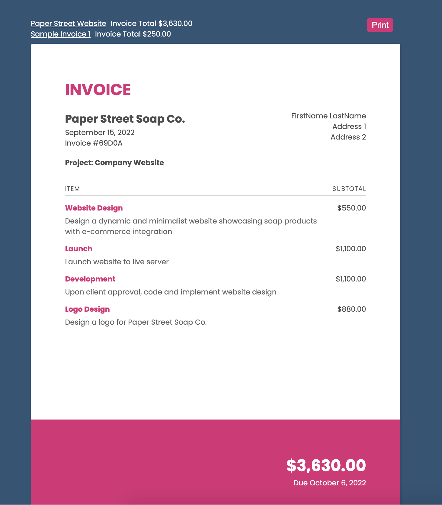

# Notion Invoice Viewer (PDF Print)

Using the Notion API to display a web interface of Invoices and select one to display and then print to PDF

## Notion Setup

- Create Clients, Projects, Tasks, Invoices databases in Notion [sample notions to be added here later]
- Create an integration
- Share your databases with the integration

## Usage

Add your notion secret token and the database ids to the .env-example file and rename to .env

```
npm install
npm start
```
